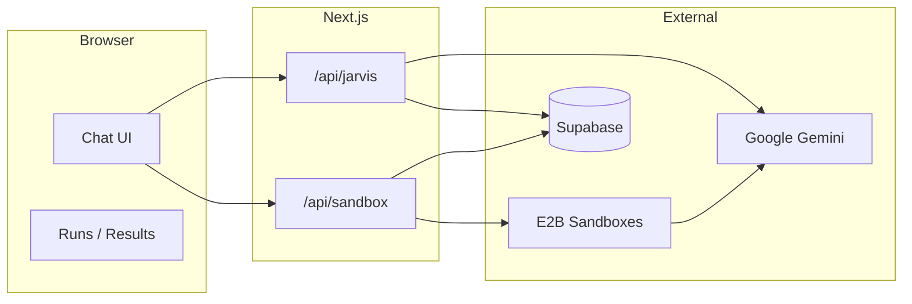

<p align="center">
  <strong>FlowOS</strong><br/>
  <sub>Autonomous research in the browser — Jarvis, sandboxed execution, real web data.</sub>
</p>

<p align="center">
  <a href="https://github.com/alexbieber/Flow-OS/blob/master/LICENSE"></a>
  <a href="https://nextjs.org/"></a>
  <a href="https://www.typescriptlang.org/"></a>
</p>

---

**FlowOS** is an open-source AI workspace where **Jarvis** chats with you, decides when to run deep research, and executes **Brains** inside isolated **[E2B](https://e2b.dev)** sandboxes. Results land in the chat as structured reports — with optional live desktop streaming when you use the desktop template.

If you want a **Manus-class loop** (search → open results → read pages → synthesize), the agent uses **Python + BeautifulSoup** over HTTP inside the sandbox — fast boots, no browser gymnastics for the default terminal path.

---

## Highlights

| Capability | Detail |
|------------|--------|
| **Jarvis** | Gemini-powered intent: chit-chat vs. kick off a research run |
| **Brains** | Pluggable automations; registry-driven steps and inputs |
| **Sandboxes** | E2B terminal (default) or custom desktop template + stream |
| **Persistence** | Supabase for runs, Jarvis messages, vault hooks |
| **UI** | Dashboard chat, runs history, marketplace, HTML export for reports |

---

## Architecture



---

## Quick start

**Requirements:** Node 20+, npm, accounts for [Supabase](https://supabase.com), [Google AI Studio](https://aistudio.google.com/) (Gemini), [E2B](https://e2b.dev).

```bash
git clone https://github.com/alexbieber/Flow-OS.git
cd Flow-OS
npm install
cp .env.example .env.local   # if you add one; otherwise create .env.local manually
npm run dev
```

Open [http://localhost:3000](http://localhost:3000).

### Environment variables

Create **`.env.local`** (never commit secrets):

| Variable | Purpose |
|----------|---------|
| `GEMINI_API_KEY` | Google Generative AI (Jarvis + agent) |
| `E2B_API_KEY` | E2B sandbox create / commands |
| `NEXT_PUBLIC_SUPABASE_URL` | Supabase project URL |
| `NEXT_PUBLIC_SUPABASE_ANON_KEY` | Supabase anon key |
| `SUPABASE_SERVICE_ROLE_KEY` | Server-side Supabase (API routes) |

Apply SQL under `supabase/` in the Supabase SQL editor (schema + optional migrations).

---

## E2B template (optional desktop)

For **noVNC / Chrome** workflows, build the template from the repo root:

- Workflow: `.github/workflows/build-template.yml` (manual dispatch)
- Dockerfile: `e2b.Dockerfile`
- Set **`E2B_ACCESS_TOKEN`** (or **`E2B_API_KEY`**, depending on CLI version) in GitHub Actions secrets

Wire the built template ID in sandbox code when using the desktop SDK path.

---

## Scripts

| Command | Description |
|---------|-------------|
| `npm run dev` | Next.js dev (Turbopack) |
| `npm run build` | Production build |
| `npm run start` | Start production server |
| `npm run lint` | ESLint |

---

## Project layout

```
src/app/           # App Router — dashboard, chat, API routes
lib/brains/        # Brain executor + agent loop
lib/sandbox/       # E2B terminal (and related helpers)
lib/ai/            # Gemini helpers
supabase/          # SQL schema & migrations
```

---

## Contributing

Issues and PRs are welcome. See [CONTRIBUTING.md](CONTRIBUTING.md) for guidelines.

---

## License

**MIT** — see [LICENSE](LICENSE). Free for commercial and personal use; attribution appreciated.

---

<p align="center">
  Built with Next.js, React, Supabase, Gemini, and E2B.
</p>
